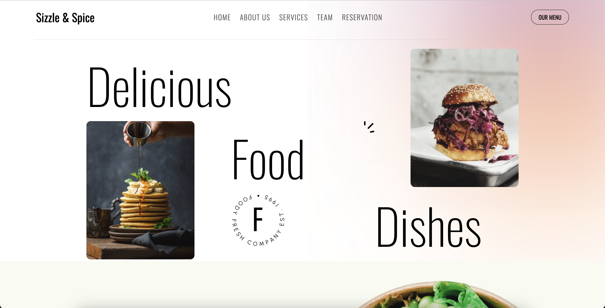

# 🏨 MERN Reservation Booking System

A full-stack reservation booking system built using the MERN stack (MongoDB, Express, React, Node.js). This system allows users to register, browse available listings, and make reservations for rooms, venues, or services. 

## 🚀 Features

### 👤 User Features
- Browse available listings
- View detailed listing pages
- Book reservations with date and time selection
- View and cancel existing reservations
  
---

## 🛠️ Tech Stack

**Frontend:**
- React.js
- React Router
- Axios
- Bootstrap / Tailwind CSS (choose one)

**Backend:**
- Node.js
- Express.js
- MongoDB (Mongoose)
- JWT Authentication
- Bcrypt for password hashing

---

## 📁 Project Structure

```bash
/mern-reservation-app
│
├── server
│   ├── config/          # DB connection & config
│   ├── controllers/     # Logic for routes
│   ├── middleware/      # Auth middleware
│   ├── models/          # Mongoose models
│   ├── routes/          # Express routes
│   ├── .env             # Environment variables
│   └── server.js        # Entry point for backend
│
├── client
│   ├── public/
│   ├── src/
│   │   ├── components/  # Reusable components
│   │   ├── pages/       # Route components
│   │   ├── services/    # Axios API calls
│   │   └── App.js       # React app entry
│   └── package.json     # React dependencies
│
└── README.md
---
```
## Screenshots


